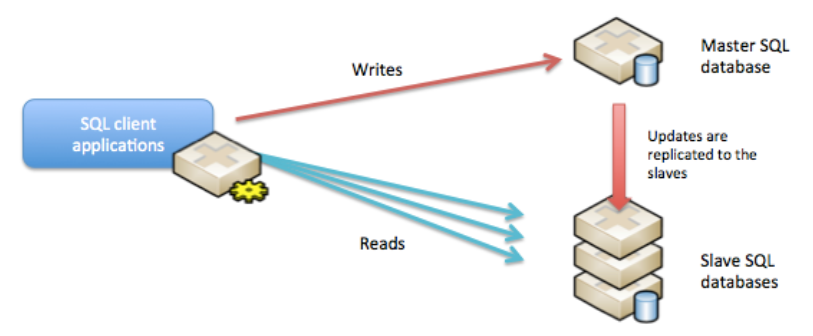
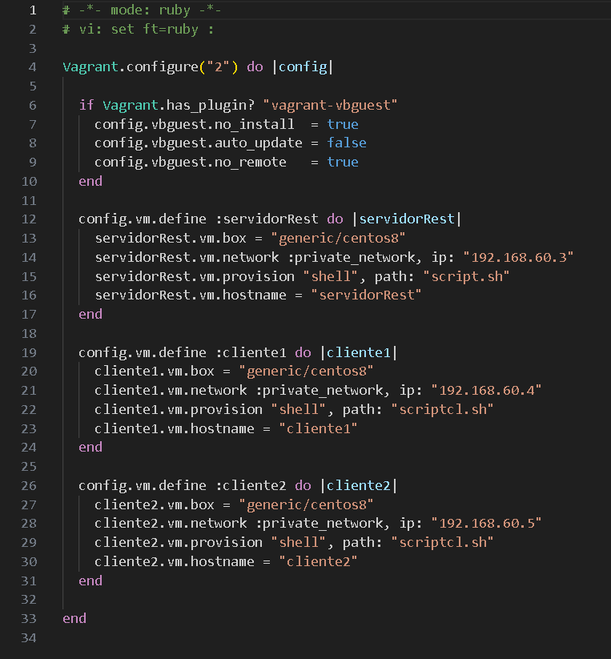
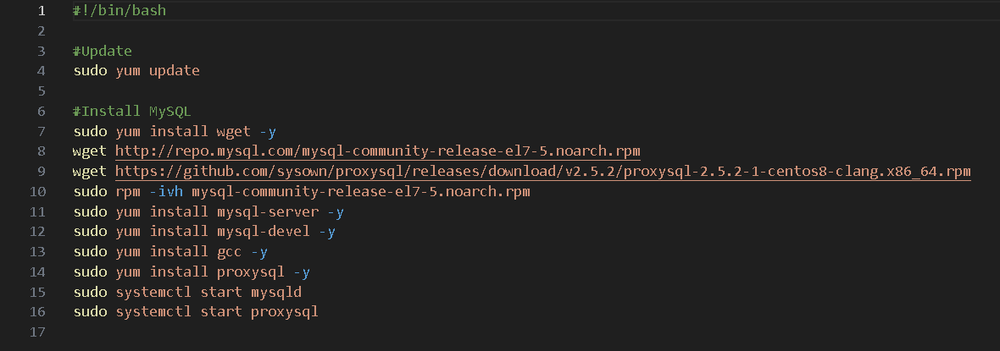
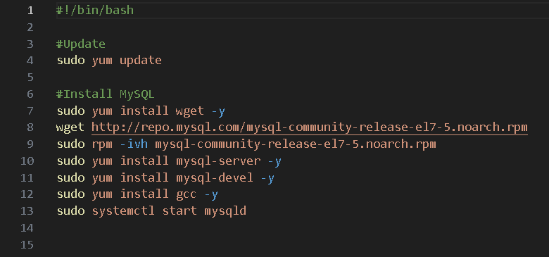
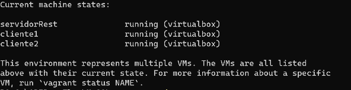

# [Balanceo de Carga de bases de datos con MySQL y ProxySQL](https://github.com/Diego28031017/ProyectoFinal.git)


## Requerimiento.
Implementar un balanceador de bases de datos MySQL con el objetivo de alcanzar una mayor eficiencia y velocidad en lo referente a escritura y lectura de datos, incrementar la tolerancia a fallos y obtener una alta disponibilidad. Para esto se debe configurar un pool de servidores de bases de datos.

## Pruebas Esperadas.
Se deben realizar al menos las siguientes pruebas:

  • Comprobar el funcionamiento con queries de lectura.
  
  • Comprobar el funcionamiento básico con queries de escritura.
  
  • Realizar pruebas de carga usando herramientas como Sysbench o similar.

## Herramientas a utilizar.
Vagrant, VirtualBox, MySQL, otros.

## Paso 1 - Descargar y descomprimir el archivo  `BalanceoMySQL-master.zip` del repositorio (https://github.com/Diego28031017/ProyectoFinal.git)
Validar que la carpeta contenga los siguiente archivos:


El archivo `vagrantfile`es usado para la configuración de las maquinas.



El archivo `script.sh` es usado para aprovisionar la maquina llamada `servidorRest` la cual para este proyecto es el maestro MySQL y ProxySQL.



El archivo `scriptcl.sh` es usado para aprovisionar las maquinas llamadas `cliente1` y `cliente2` las cuales para este proyecto son los esclavos MySQL.



## Paso 2 - En la consola de comandos de la maquina anfitrión dirijirse a la ruta donde descomprimio el archivo `BalanceoMySQL-master.zip`.
Arranque las maquinas con este comando:
``` bash 
vagrant up
```
Nota: Cuando se ejecuta este comando por primera vez es demorado, aproxidamante 10 minutos o mas dependiendo de los recursos de hardware de la maquina anfitrión.

Verifique el estado de las maquinas con el comando: 
``` bash 
vagrant status
```
Deberia ver algo asi en la consola de comandos:



Para iniciar sesión en las maquinas ejecute este comando: 
``` bash 
vagrant ssh NombreMaquina
```
Nota: Reemplace `NombreMaquina` por una de las creadas en este proyecto `servidorRest`, `cliente1`, `cliente2`.

## Paso 3 - Configurar la replicación de bases de datos MySQL Maestro - Esclavos.
Inicie sesión ssh en el maestro
``` bash 
vagrant ssh servidorRest
```
Loggearse con el super usuario
``` bash 
sudo -i
```
Genere las claves privadas y publicas para poder exportar la base de datos del maestro a los esclavos
``` bash 
ssh-keygen
```
Abrir los directorios y/o archivos ocultos
``` bash 
ls -la
```
Otorgue los permisos al directorio y los archivos
``` bash 
chmod 700 ~/.ssh
```
``` bash 
chmod 600 ~/.ssh/authorized_keys
```
Dirigirse a la ruta
``` bash 
cd /.ssh
```
Cree el siguiente archivo
``` bash 
touch authorized_keys
```
# NOTA: Repita a partir del paso 3 los anteriores comandos en las maquinas `cliente1` y `cliente2`

En los clientes se pega la clave publica del servidor rest `id_rsa.pub` en el archivo `authorized_keys`

Para acceder al archivo `id_rsa.pub` ejecute el siguiente comando en la consola una vez haya iniciado sesion ssh en el `servidorRest`, tenga en cuenta iniciar sesion con el super usuario.
``` bash 
cd /.ssh
```
Consultar la llave publica del maestro y copiarla completamente
``` bash 
cat id_rsa.pub
```
Una vez copiada la llave publica dirigirse a los esclavos `cliente1` y `cliente2` y pegarla en el archivo `authorized_keys`.

Dirigirse a la ruta
``` bash 
cd /.ssh
```
Modifique el archivo
``` bash 
vim authorized_keys
```
Pegue la clave publica del maestro. Para guardar los cambios ejecute
`ESC` + `:` + `wq`

## Paso 4 - Configuración firewalld.

Regresar a la ruta `/root`
``` bash 
cd /root
```
Agregue el servicio mysql al firewall de forma permanente
``` bash 
firewall-cmd --permanent --add-service=mysql
```
Reinicie el servicio firewall para guardar los cambios
``` bash 
firewall-cmd --reload
```
# NOTA: Repita a partir del paso 4 los anteriores comandos en las maquinas `cliente1` y `cliente2`

## Paso 5 - Configuración MySQL Maestro-Esclavos
Configuración del maestro:
Inicie sesión ssh en el maestro
``` bash 
vagrant ssh servidorRest
```
Loggearse con el super usuario
``` bash 
sudo -i
```
Encender el servicio de mysql con el siguiente comando
``` bash 
service mysqld start
```
NOTA: Verificar los archivos mencionados a continuación, en caso que sea necesario pegar las lineas de codigo faltante.

Editar el archivo `my.cnf`
``` bash 
vim /etc/my.cnf
```
Agregue las siguientes lineas de codigo
``` bash 
[mysqld]
bind-address=192.168.60.3
server-id=1
log_bin=mysql-bin
binlog-format=ROW 
log_slave_updates=ON
```
Para guardar los cambios ejecute
`ESC` + `:` + `wq`
Reinicie el servicio mySQL
``` bash 
service mysqld restart
```
Inicie sesión en `MySQL`
``` bash 
mysql -u root -p
```

Cree los usuarios que permitiran la comunicación entre el maestro y los esclavos
``` bash 
CREATE USER 'slave1'@'192.168.60.4' IDENTIFIED BY 'contra1234';
CREATE USER 'slave2'@'192.168.60.5' IDENTIFIED BY 'contra12345';
```
Otorgue permisos a estos usuarios
``` bash 
GRANT REPLICATION SLAVE ON *.* TO 'slave1'@'192.168.60.4';
GRANT REPLICATION SLAVE ON *.* TO 'slave2'@'192.168.60.5';
```
Valide que los usuarios hayan sido creados correctamente
``` bash 
SELECT User, Host FROM mysql.user; 
```
Valide el estatus del maestro MySQL
``` bash 
SHOW MASTER STATUS; 
```
NOTA: Debe tener en cuenta la información obtenida del comando anterior, pues esta información sera importante para la configuración de los esclavos.

Detenga el estado de los esclavos
``` bash 
STOP SLAVE; 
```
Salga de la configuración MySQL ejecutando `exit`

Cree un archivo `backup.sql` para poder enviar esta configuracion a los esclavos
``` bash 
mysqldump --all-databases -u root>backup.sql 
```
Pegue este archivo a cada uno de los esclavos `cliente1` y `cliente2`
``` bash 
scp /root/backup.sql root@192.168.60.4:/root/
scp /root/backup.sql root@192.168.60.5:/root/ 
```

Configuración del esclavo:
Inicie sesión ssh en el esclavo
``` bash 
vagrant ssh cliente1
```
y/o
``` bash 
vagrant ssh cliente2
```
Loggearse con el super usuario
``` bash 
sudo -i
```
NOTA: Verificar los archivos mencionados a continuación, en caso que sea necesario pegar las lineas de codigo faltante.

Editar el archivo `my.cnf`
``` bash 
vim /etc/my.cnf
```
Agregue las siguientes lineas de codigo

Para el `cliente1`
``` bash 
[mysqld]
bind-address=192.168.60.4
server-id = 2
log_bin=mysql-bin
binlog-format=ROW 
log_slave_updates=ON
```
Para el `cliente2`
``` bash 
[mysqld]
bind-address=192.168.60.5
server-id = 3
log_bin=mysql-bin
binlog-format=ROW 
log_slave_updates=ON
```
Reinicie el servicio MySQL en el `cliente1` y `cliente2`
``` bash 
service mysqld restart
```
Importe el archivo `backup.sql` en el `cliente1` y `cliente2`
``` bash 
mysql -u root < /root/backup.sql	//importar a mysql
```
Inicie sesión en `MySQL` en el `cliente1` y `cliente2`
``` bash 
mysql -u root -p
```
Para el `cliente1`
``` bash 
STOP SLAVE;
```
``` bash 
CHANGE MASTER TO MASTER_HOST='192.168.60.3', MASTER_USER='slave1', MASTER_PASSWORD='contra1234', MASTER_LOG_FILE='mysql-bin.000001', MASTER_LOG_POS=1214;
```
``` bash 
START SLAVE;
```
Validar  las siguientes lineas esten configuradas asi ejecutando el comando siguiente `Slave_IO_Running: Yes` , `Slave_SQL_Running: Yes` , `Last_Error: `, `Last_SQL_Error: ` , `Master_Host: 192.168.60.3` , `Master_User: slave1` , `Master_Port: 3306`
``` bash 
SHOW SLAVE STATUS \G
```
Salga de la configuración MySQL ejecutando `exit`

Para el `cliente2`
``` bash 
STOP SLAVE;
```
``` bash 
CHANGE MASTER TO MASTER_HOST='192.168.60.3', MASTER_USER='slave2', MASTER_PASSWORD='contra12345', MASTER_LOG_FILE='mysql-bin.000001', MASTER_LOG_POS=1214;
```
``` bash 
START SLAVE;
```
Validar  las siguientes lineas esten configuradas asi ejecutando el comando siguiente `Slave_IO_Running: Yes` , `Slave_SQL_Running: Yes` , `Last_Error: `, `Last_SQL_Error: ` , `Master_Host: 192.168.60.3` , `Master_User: slave2` , `Master_Port: 3306`
``` bash 
SHOW SLAVE STATUS \G
```
Salga de la configuración MySQL ejecutando `exit`

Reinicie el servicio mySQL en el `cliente1` y `cliente2`
``` bash 
service mysqld restart
```
## Paso 6 - Validar la replica de bases de datos a los esclavos desde el maestro
Inicie sesión ssh en el maestro
``` bash 
vagrant ssh servidorRest
```
Loggearse con el super usuario
``` bash 
sudo -i
```
NOTA: Verificar los archivos mencionados a continuación, en caso que sea necesario pegar las lineas de codigo faltante.
Inicie sesión en `MySQL`
``` bash 
mysql -u root -p
```
Vea todas las bases de datos existentes en `MySQL`
``` bash 
SHOW DATABASES;
```
Cree una base de datos `PRUEBA`
``` bash 
CREATE DATABASE PRUEBA;
```
Valide que se creo correctamente
``` bash 
SHOW DATABASES;
```
Ingrese a la base de datos `PRUEBA`
``` bash 
USE PRUEBA;
```
Cree una tabla llamada `books` con la siguiente estructura
``` bash 
CREATE TABLE books (
id int NOT NULL AUTO_INCREMENT PRIMARY KEY,
title varchar(255),
description varchar(255),
author varchar(255)
);
```
Valide que se creo correctamente
``` bash 
SHOW TABLES;
```
Agregue una fila a la tabla
``` bash 
INSERT INTO books VALUES(null, "La hojarasca", "interesante", "gabo");
```
Valide que se creo correctamente
``` bash 
SELECT * FROM books;
```
Una vez creada esta fila correctamente inicie sesión ssh en el `cliente1` y/o `cliente2`, tenga en cuenta iniciar sesion con el super usuario. 

Valide que la base de datos, tabla y fila creada en el servidor maestro se hayan replicado en los esclavos
Inicie sesión en `MySQL`
``` bash 
mysql -u root -p
```
Vea todas las bases de datos existentes en `MySQL`
``` bash 
SHOW DATABASES;
```
Valide que se creo correctamente la base de datos `PRUEBA`
``` bash 
SHOW DATABASES;
```
Ingrese a la base de datos `PRUEBA`
``` bash 
USE PRUEBA;
```
Valide la tabla `books`
``` bash 
SHOW TABLES;
```
Valide la información de la tabla `books`
``` bash 
SELECT * FROM books;
```

Una vez validado todo y que este correctamente salga de la configuración MySQL ejecutando `exit`.

## Paso 7 - Configuración ProxySQL

Encender el servicio de proxysql con el siguiente comando
``` bash 
service proxysql start
```
Se ingresa esta linea para entrar a la interfaz de admin del proxysql
``` bash 
mysql -u admin -padmin -h 127.0.0.1 -P6032 --prompt 'ProxySQL Admin> '
```
Nota: En la parte izquierda de la consola aparecera una frase que dice `ProxySQL Admin> ` esto quiere decir que ya estas dentro de la consola de admin del proxysql
Ya estando en la interfaz de admin se ingresa el siguiente comando; este comando permite visualizar las diferentes bases de datos del proxysql
``` bash 
show databases;
```
Este comando permite ver las diferentes tablas del proxysql
``` bash 
show tables;
```
Este comando muestra la informacion de una base de datos que esta configurada por defecto en el proxysql, normalmente es una llamada `admin`
``` bash 
show database();
```
Este comando es para poder visualizar que parametros de la tabla de mysql_servers se pueden configurar
``` bash 
show create table mysql_servers\G
```
A continuacion se configuran los datos necesarios para el maestro y los dos esclavos
Nota: Informacion del maestro
``` bash 
INSERT INTO mysql_servers (hostgroup_id, hostname, status, max_connections, port) VALUES (1,'192.168.60.3','ONLINE', 100, 3306);
```
Nota: Informacion del `cliente1` (esclavo1)
``` bash 
INSERT INTO mysql_servers (hostgroup_id, hostname, status, max_connections, port) VALUES (2,'192.168.60.4','ONLINE', 100, 3306);
```
Nota: Informacion del `cliente2` (esclavo2)
``` bash 
INSERT INTO mysql_servers (hostgroup_id, hostname, status, max_connections, port) VALUES (2,'192.168.60.5','ONLINE', 100, 3306);
```
A continuacion se selecciona la tabla que se acabo de crear para visualizar la informacion ingresada y configurada
``` bash
select * from mysql_servers;
```
Despues se pone el siguiente comando para crear otra tabla de configuracion
``` bash
show create table mysql_replication_hostgroups\G
```
Se ingresa la siguiente linea para configurar los parametros deseados
``` bash
INSERT INTO mysql_replication_hostgroups (writer_hostgroup,reader_hostgroup,check_type) VALUES (1, 2,'read_only');
```
A continuacion se selecciona la tabla que se acabo de crear para visualizar la informacion ingresada y configurada
``` bash
select * from mysql_replication_hostgroups;
```
Las siguientes dos lineas es para guardar los parametros configurados tanto en el tiempo de ejecucion como en el disco del servicio para que quede guardado siempre
``` bash
load mysql servers to runtime;
```
``` bash
save mysql servers to disk;
```


