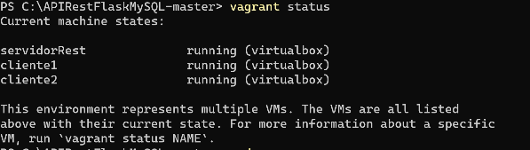

# [Balanceo de Carga de bases de datos con MySQL y ProxySQL](https://github.com/Diego28031017/ProyectoFinal.git)


## Requerimiento.
Implementar un balanceador de bases de datos MySQL con el objetivo de alcanzar una mayor eficiencia y velocidad en lo referente a escritura y lectura de datos, incrementar la tolerancia a fallos y obtener una alta disponibilidad. Para esto se debe configurar un pool de servidores de bases de datos.

## Pruebas Esperadas.
Se deben realizar al menos las siguientes pruebas:

  • Comprobar el funcionamiento con queries de lectura.
  
  • Comprobar el funcionamiento básico con queries de escritura.
  
  • Realizar pruebas de carga usando herramientas como Sysbench o similar.

## Herramientas a utilizar.
Vagrant, VirtualBox, MySQL, otros.

## Paso 1 - Descargar y descomprimir el archivo  `BalanceoMySQL-master.zip` del repositorio (https://github.com/Diego28031017/ProyectoFinal.git)
Validar que la carpeta contenga los siguiente archivos:


El archivo `vagrantfile`es usado para la configuración de las maquinas.


El archivo `script.sh` es usado para aprovisionar la maquina llamada `servidorRest` la cual para este proyecto es el maestro MySQL y ProxySQL.


El archivo `scriptcl.sh` es usado para aprovisionar las maquinas llamadas `cliente1` y `cliente2` las cuales para este proyecto son los esclavos MySQL.


#### Paso 2 - En la consola de comandos de la maquina anfitrión dirijirse a la ruta donde descomprimio el archivo `BalanceoMySQL-master.zip`.
Arranque las maquinas con este comando:
``` bash 
vagrant up
```
Nota: Cuando se ejecuta este comando por primera vez es demorado, aproxidamante 10 minutos o mas dependiente de los recursos de hardware de la maquina anfitrión.

Verifique el estado de las maquinas con el comando: 
``` bash 
vagrant status
```
Deberia ver algo asi en la consola de comandos:



Para iniciar sesión en las maquinas ejecute este comando dependiendo 
``` bash 
vagrant ssh NombreMaquina
```
Nota: Reemplace `NombreMaquina` por una de las creadas en este proyecto `servidorRest`, `cliente1`, `cliente2`.
